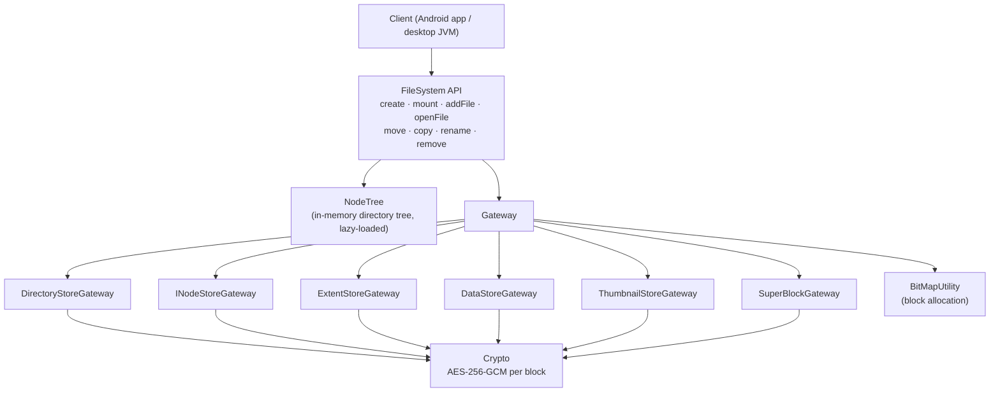

# Aqua: an encrypted, portable filesystem in userspace (Java)

A complete filesystem written from scratch in Java: its own on-disk format, allocator, directory tree, inodes and extents, with every block encrypted using AES-256-GCM.

A vault is just a folder of opaque files. Copy that folder to any device with a JVM (an Android phone, a Linux or Windows laptop) and it opens with the password. There's no cloud, no server and no account. Nothing about the contents leaks from the files on disk: file names, folder structure, sizes and data are all encrypted.

This library is the engine behind **[Vault](https://github.com/hamzaasgharkhan/Vault)**, an Android app (Kotlin, Jetpack Compose) for keeping private photos and files in encrypted, portable vaults.

## Why

Phone "secure folders" and gallery lockers either tie your files to one device or push them to someone's cloud. I wanted a vault that:

- is **encrypted at rest** with a key only the user knows,
- is **portable**: a plain directory you can copy over USB, an SD card or any file transfer, then open on another device,
- doesn't depend on the host OS's filesystem features, so it behaves the same on every platform.

Encrypting files one by one on the host filesystem still exposes names, folder structure and file sizes. Building a filesystem *inside* a set of encrypted container files hides all of that.

## Architecture



### On-disk layout

A mounted vault is one directory:

| File | Contents |
|---|---|
| `super-block` | Vault name, number of each store, key-derivation salt, magic values. Encrypted. |
| `directory-store` | The directory tree. Each entry holds its name plus parent / first-child / previous-sibling / next-sibling pointers and an inode pointer. |
| `inode-store` | Inodes: size, flags, creation and modification times, extent address and count, thumbnail pointer. |
| `extent-store` | Extent records `(block index, offset, length, next)`, chained so a file can be stored in non-contiguous runs. |
| `data-store` | File contents in 4 KB encrypted blocks. |
| `thumbnail-store` | Pre-generated image thumbnails, so a gallery view can load without decrypting full-size photos. |
| `*.bitmap` | One allocation bitmap per store. |

### Design decisions

- **Per-block encryption.** Every 4096-byte block is sealed on its own with AES-256-GCM and a fresh random 96-bit IV. Random access stays cheap, because reading a file decrypts only the blocks it touches. GCM's authentication tag also detects any tampered or corrupted block.
- **Password-derived keys.** Keys come from the password through PBKDF2-HMAC-SHA256 (65,536 iterations, 256-bit key) with a random 16-byte salt per vault. The password is never stored. A wrong password fails GCM authentication when the superblock is opened.
- **Extents instead of per-block pointers.** Files are described as runs of blocks, which keeps metadata small for large files like videos.
- **Sub-block packing.** Each data block carries its own small bitmap of free byte runs, so small files and file tails can share a block instead of wasting most of 4 KB.
- **Two allocation-bitmap types.** Metadata stores use a plain one-bit-per-block bitmap. The data and thumbnail stores use a 4-bit-per-block ("half") bitmap that records whether a block is free, full or partially filled.
- **Magic values in every frame** (`0x41717561`, "Aqua") act as a cheap sanity check on every structure read from disk.
- **Lazy directory loading.** A directory's children are read from disk only when it's opened, so mounting a large vault is fast.

## Usage

```java
FileSystem fs = FileSystem.createFileSystem(new File("/some/folder"), "MyVault", password);
fs.createDirectory("/", "photos");
fs.addFile(new InputFile("beach.jpg", "/photos", size, created, modified, inputStream));

// later, on any device that has a copy of the folder:
FileSystem vault = FileSystem.mount(new File("/some/folder/MyVault"), password);
try (CustomInputStream in = vault.openFile("/photos/beach.jpg")) {
    in.transferTo(out);
}
```

Also supported: `openDirectory`, `openThumbnail`, `moveNode`, `copyNode`, `renameNode` and `removeNode` (with recursive delete).

## Building

This is a plain Java project. Its dependencies are in `lib/`: Bouncy Castle, Thumbnailator for thumbnail generation, and JUnit 5.

```bash
javac -d out -cp "lib/*" $(find src -name '*.java' -not -name '*Tests.java')
```

Tested on JDK 21. `filesystem.jar` is the prebuilt library the Android app uses.

## Tests

The JUnit 5 tests cover binary encoding utilities, the superblock, gateway initialization, the data store and extent store (`src/**/*Tests.java`).

## Known limitations

- The superblock key is derived with a fixed salt, because the per-vault salt is stored *inside* the superblock. The fix is a small plaintext header that holds the salt.
- No journaling yet. A crash in the middle of a write can leave a store inconsistent.
- Single-threaded, with no locking for concurrent access.
- No build tool yet. Moving to Gradle would make building and running the tests one command.

## Tech

Java · AES-256-GCM · PBKDF2 · Bouncy Castle · JUnit 5 · Thumbnailator
